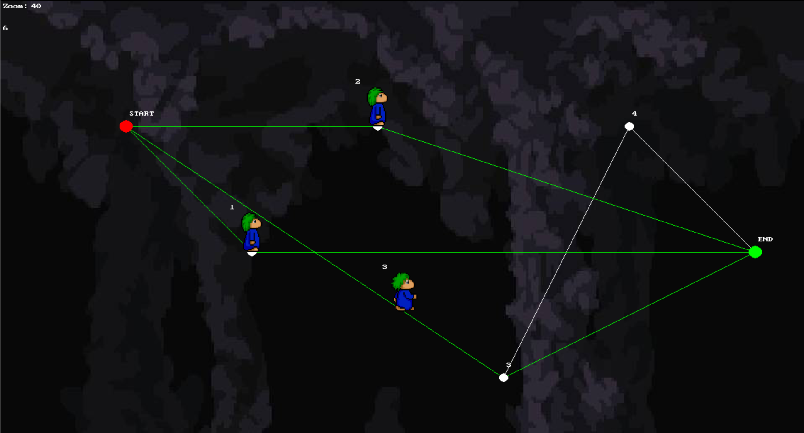

# Lem-In
Lem-in project done @WeThinkCode

At the beginning, from the standard output the programme recieves information about the number of ants that has to be lead through a maze.
As well as the rooms and the links that the rooms have creating the maze.

The Algorithim we implemented is a Breadth First Search which traverses the entire map, finds all paths to the end room, and then sends the appropriate amount of ants down each path.

Done by: https://github.com/gwasserfall && https://github.com/Ayano2000

🍋🍋🍋🍋🍋
